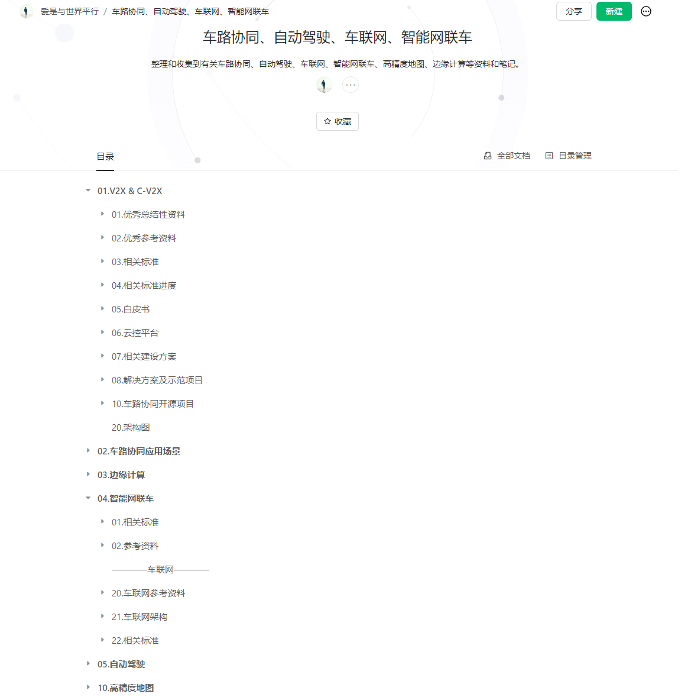

# 车路协同、车联网、智慧交通、智能网联车、自动驾驶、无人驾驶、高精度地图

17年11月开始工作，从事交通行业，主要为公路、高速、公交、交通相关项目。虽然是个Java开发工程师，但在工作之中，对业务也十分感兴趣，多数业务都是自己去梳理、整理、归纳的。

2021年接触到车路协同行业，同作为交通领域的相关内容，引起了我非常大的兴趣，在接触车路协同后，便开始源源不断的研究和学习车路协同领域相关内容，包括车路协同标准规范、车路协同云控平台、车路协同解决方案、车联网、智能网联车、自动驾驶、高精度地图等，在学习的过程中，将好的资料不断进行收纳整理，并将部分优质内容进行归纳。

目前阿里云盘包括车路协同标准规范数百篇，参考解决方案、参考资料、参考文献、解决方案等内容均有整理，作为开源项目的爱好者，将所有资料一直都是免费分享和共享的，欢迎车路协同朋友一起研究和互相交流。

VX：lovebetterworld

Email：1090239782@qq.com

车路协同优质资料整理地址：

- 语雀：[车路协同、自动驾驶、车联网、智能网联车 · 语雀 (yuque.com)](https://www.yuque.com/lovebetterworld/c-v2x)
- 个人网站：[车路协同 | 爱是与世界平行 (lovebetterworld.com)](https://www.lovebetterworld.com/cvis/)
- GItee：[自动驾驶: 整理车路协同自动驾驶相关的内容，为车路协同自动驾驶提供资料和笔记，包含车路协同解决方案，车路协同参考资料、车路协同规范，车路协同云控平台，高精度地图，Appllo自动驾驶学习笔记等。 (gitee.com)](https://gitee.com/AiShiYuShiJiePingXing/auto-driving)
- CSDN：[爱是与世界平行的博客_CSDN博客-智慧交通与车路协同,▷项目总结,▷大数据领域博主](https://blog.csdn.net/an1090239782)

因阿里云盘内容太多，没办法直接一个网盘进行分享，遂对某部分感兴趣的，可以加好友，单独分享。

## 免责声明

- 本站所有文章为了记录工作、编程及生活随笔，不当之处，仅供参考；
- 本站文章引用或转载写明来源，感谢原作者的辛苦写作，如果有异议或侵权，及时联系我处理，谢谢；
- 本站所有文章仅代表个人当时意见和想法；
- 内容转载请保留署名以及原文连接，谢谢；
- 本网站所有作品采用 [知识共享署名-相同方式共享 4.0 国际许可协议](http://creativecommons.org/licenses/by-sa/4.0/) 进行许可！